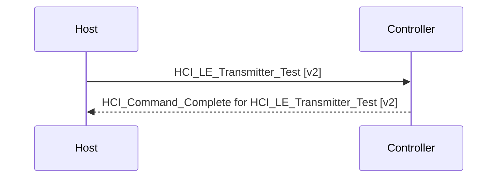

# HCI JSONL Sequence Diagram 設計

## 1. 目的

HCI Analyzerの解析終了時に、そのセッションで保存したJSONLログを入力として、
HostとController間のHCI通信をMermaid `sequenceDiagram`へ変換する。

変換結果は新規のMarkdownプレビューウィンドウへ描画する。
保存ボタンを押すと、`.md`とプレビュー全体の`.png`スクリーンショットを
まとめて保存する。

## 2. 入力

入力はAnalyzerが保存したJSON Lines形式のログファイルとする。

対象レコード:

- `direction = host_to_controller`または`HOST_TO_CTRL`のHCI Command
- `direction = controller_to_host`または`CTRL_TO_HOST`のHCI Event

`unknown`、`manual`、System、Noiseなど、Host/Controller間の矢印にできない
レコードは図から除外する。不正なJSON行は他の行の変換を止めずスキップする。

## 3. シーケンス変換



### 3.1 HCI Command

HostからControllerへの実線矢印として出力する。

表示内容:

- コマンド名とversion
- 主要パラメーター
- 不明Opcodeの場合はOpcodeとRAW Hex
- OGF `0x3F`の場合はVendor Commandとして表示

### 3.2 HCI Event

ControllerからHostへの戻り矢印として出力する。

- `HCI_Command_Complete`
- `HCI_Command_Status`

上記はイベント内のCommand Opcodeを読み、同じOpcodeを持つ直前のHCI Commandと
紐付けて対象コマンド名を表示する。パーサがOpcodeを認識できない場合もRAWから
Opcodeを読み取って紐付ける。

`HCI_LE_Meta_Event`は`subevent_code`を使用し、既知の場合はsubevent名を表示する。
未知subeventはコードを表示する。

Vendor Specific Event `0xFF`および不明EventはRAW Hexを表示し、変換対象から
除外しない。

## 4. 表示ウィンドウ

解析終了ボタンを押した後、JSONLを閉じてからシーケンス図ウィンドウを開く。

ウィンドウには、Markdownの見出しとMermaidシーケンス図に相当する
Host／Controllerのライフラインおよび矢印を表示する。
表示領域が縦長になった場合はスクロールできる。

アプリ自体を閉じる際は、新しいシーケンス図ウィンドウを開かない。

## 5. 出力形式

シーケンス図ウィンドウで保存形式を選択する。

| 形式 | 内容 |
|---|---|
プレビューウィンドウの保存ボタンから次の2種類を同時に出力する。

| 形式 | 内容 |
|---|---|
| `.md` | Mermaidコードブロックを含むMarkdown |
| `.png` | スクロール範囲を含むプレビュー全体のスクリーンショット |

保存先は入力JSONLと同じフォルダとし、保存先やファイル名を選択する
ダイアログは表示しない。出力名は入力JSONLのstemに`_sequence`を付加する。
同名ファイルが存在する場合は上書きする。

例:

```text
hci_20260716_202916.jsonl
hci_20260716_202916_sequence.md
hci_20260716_202916_sequence.png
```

## 6. エラー処理

- JSONL読込失敗はAnalyzerログへ`SEQUENCE_DIAGRAM_ERROR`として表示
- 不正JSON行はスキップ
- 不明Opcode、Vendor Command/EventはRAW表示で継続
- ファイル保存失敗はシーケンス図ウィンドウ内へ表示
